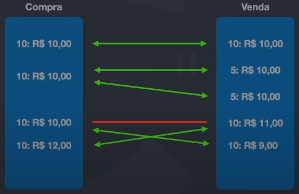
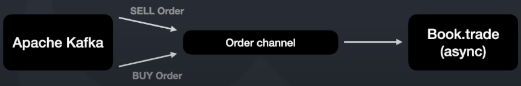

# c2-container

No segundo nível podemos verificar, de forma mais detalhada, como a arquitetura do _Code Invest_ está interligada aos seus componentes, além das tecnologias que fazem parte deste ecossistema.

### Requisitos funcionais

- Simulador da bolsa possui um algoritmo ligeiramente complexo para fazer o match das ordens de compra e venda

### Requisitos não funcionais

- As operações devem ser "_in memory_" a fim aumentar a agilidade na execução do mesmo, e para isso as principais alocações precisam ficar na memória _heap_

- Garantia de _memory safe_ a partir do recurso de _channels_ da linguagem Go

### Algoritmo de _match_ das ordens de compra e venda

Esse algoritmo consiste em 2 filas (uma de compra e uma de venda) e será feito comparações entre elas para conseguir conciliar a oferta com a demanda da melhor forma possível. Veja a ilustração abaixo:

Cada vez que uma ordem de compra e venda dão "match", é gerado uma transação que será publicada no Apache Kafka no formato JSON.

### _Memory safe_ com _channels_

A fim de evitar erros como _race condition_ o qual ocorre quando 2 ou + threads tentam alterar um valor ao mesmo tempo.

Para isso, como solução foi adotado o recurso de _channels_ da linguagem Go que fornece um "canal" de comunicação entre 2 ou + threads e o dado que está nesse canal será coletado por uma dessas threads conectadas a esse canal.

O papel das _channels_ na aplicação é para que todas as ordens de compra e venda sejam enviadas a um único _channel_ de input para serem registradas no "livro" (_Book_) de compra/venda.

Além disso, quando ocorre um "match" é criado uma transação que será enviada a um _channel_ de output para assim ser armazenado no Apache Kafka

